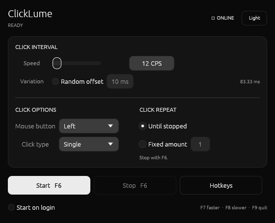
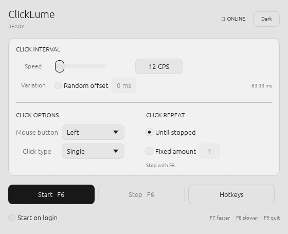

# ClickLume

ClickLume is a native autoclicker for **Ubuntu 24.04, GNOME 46, and Wayland**.
It uses Linux `uinput` for reliable clicks and passive `evdev` reads for global
hotkeys—no X11 fallback and no root process at runtime.

> Project status: pre-release. Ubuntu 24.04 GNOME Wayland is the tested and
> supported environment; other compositors are not yet claimed as supported.

| Dark | Light |
|---|---|
|  |  |

## Features

- Compact monochrome GUI with persistent light and dark modes
- 1–1000 clicks per second
- Left, middle, and right mouse buttons
- Single, double, and hold click modes
- Unlimited or fixed repeat counts
- Optional randomized interval offset
- Configurable F1–F12 global hotkeys
- Optional start-on-login user service
- CLI for scripts and troubleshooting

## Install

### Ubuntu package

Download the `.deb` from the GitHub release page, then run:

```bash
sudo apt install ./clicklume_<version>_amd64.deb
sudo usermod -aG input "$USER"
```

Log out and back in once so the new group membership reaches your desktop
session. Launch **ClickLume** from the app menu.

### Release archive

Extract the release archive and run:

```bash
./install.sh
```

The installer copies ClickLume into your user directories. Administrator access
is requested only for udev rules and input-group membership.

### Build from source

```bash
git clone https://github.com/de2pressed/clicklume.git
cd clicklume
cargo build --release --locked
./install.sh
```

Rust stable and the normal Ubuntu desktop development libraries are required.

## Usage

| Default key | Action |
|---|---|
| F6 | Start or stop clicking |
| F7 | Increase click rate |
| F8 | Decrease click rate |
| F9 | Quit ClickLume |

Hotkeys are read passively: ClickLume does not grab or suppress the keys, so
they still reach the focused application.

The command-line client is also available:

```bash
clicklume-cli toggle
clicklume-cli inc
clicklume-cli dec
clicklume-cli start
clicklume-cli stop
```

## Wayland design

GNOME Wayland does not let ordinary applications inject global pointer events
or read global pointer coordinates. ClickLume creates a virtual Linux input
device instead:

```text
ClickLume GUI ──Unix socket──> click backend ──uinput──> GNOME/libinput
                                  ▲
physical keyboards ──evdev────────┘
```

The virtual mouse declares `REL_X` and `REL_Y` capabilities even though it does
not move the pointer. This is required for libinput to classify the device as a
mouse and forward its button events to Mutter.

## Permissions and security

ClickLume never runs as root. One-time setup grants access to `/dev/uinput` and
adds the desktop user to the Linux `input` group for global hotkeys.

Membership in `input` allows software running as that user to read physical
input devices. Only install software you trust. If you do not want that access,
install with `./install.sh --skip-system-setup`; clicking still works when
`uinput` access is available, but global hotkeys may not.

## Intentional limitations

- Clicks occur at the current pointer location.
- Global coordinate picking is not exposed by GNOME 46 to ordinary clients.
- Macro recording is outside this focused autoclicker scope.
- X11 and other Wayland compositors are not part of the initial support claim.

## Configuration

Settings follow `XDG_CONFIG_HOME` when it is set, otherwise they live under:

```text
~/.config/clicklume/config.toml
~/.config/clicklume/state.toml
```

The first ClickLume launch automatically migrates compatible settings from the
pre-release `~/.config/autoclick` directory when present.

## Uninstall

For a `.deb` installation:

```bash
sudo apt remove clicklume
```

For a user installation:

```bash
./uninstall.sh
```

## Development

```bash
cargo fmt --all -- --check
cargo clippy --workspace --all-targets -- -D warnings
cargo test --workspace --locked
cargo build --release --locked
```

Runtime changes must also pass the smoke test documented in the project.
See [CONTRIBUTING.md](CONTRIBUTING.md) before opening a pull request.

## License

[MIT](LICENSE)
